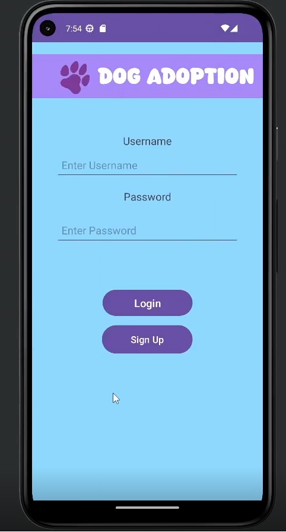

# Roseller Rene M. Santos Portfolio

Hi! I am a Computer Science student from Mapúa University who specializes in Application Development. Thrives in project-based learning and comfortable with C#, Java, Python. An adaptable learner who loves building practical applications and solving real-world problems.

---

## 🚀 Projects

### 🐶 Dog Adoption App
A full-stack Android application for managing dog adoption records with admin and user views.  
[GitHub Repo](https://github.com/DahRealRuz/Dog_Adoption)

---

### 🧁 InventoryPro
A desktop inventory manager for a bake shop with admin/user dashboards.  
[GitHub Repo](https://github.com/DahRealRuz/InventoryPro)

---

### 🪐 Capybaras in Space *(Work in Progress)*
A 2D game blending platforming and space shooter mechanics. Includes a Firebase-powered leaderboard and a web leaderboard viewer built with React.  
[GitHub Repo](https://github.com/DahRealRuz/CapybarasINSPACE)

---

## 🛠️ Skills

**Languages:** Python, Java, JavaScript, SQL, GDScript  
**Frameworks:** Spring Boot, React, Firebase, Retrofit, Glide  
**Tools:** Git, GitHub, Android Studio, Godot, MySQL, Tkinter

---

## 📫 Contact

- GitHub: [github.com/ruzdev]([https://github.com/ruzdev](https://github.com/DahRealRuz))
- Email: rosellerrene.santos@gmail.com
